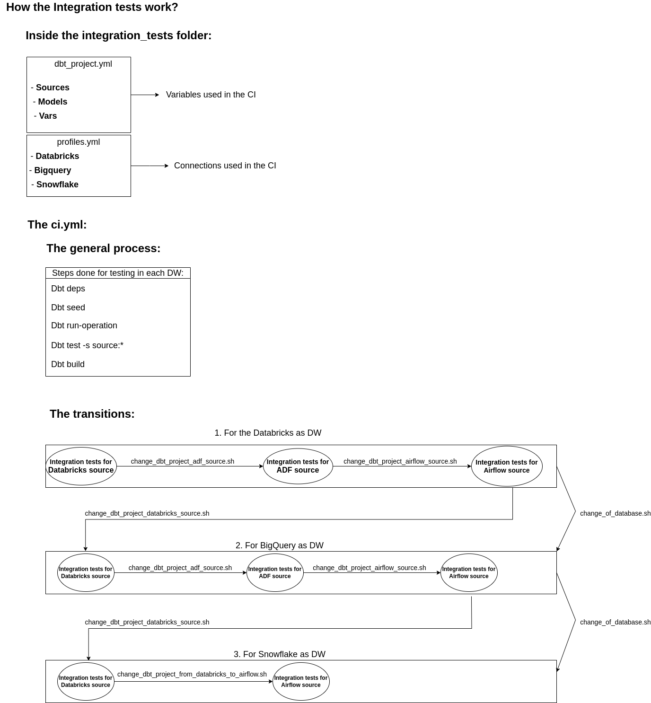

> [!WARNING]  
> ADF source and models was NOT tested in Snowflake connection!

This README is about the integration tests step inside the ci.yml.

 Integration tests work in a similar way to how an user can reference the dbt-dag-monitoring in their project. That is how we start it, running 
	dbt deps in the packages: local: ../
In that way, we are pulling dbt-dag-monitoring.
 
  As we are simulating the use of the project somewhere else, when checking dbt_project.yml inside the integration_tests folder, we can see that we configured the sources, the models, and vars of it. Those settings are crucial to run the project. 

  When running the continuous integration in the Github actions, where the integration tests are actually analyzed, we are using the dbt_project.yml inside the integration_tests folder as reference.

By looking at the profiles.yml folder, we can see that we use 3 connections: Databricks, BigQuery and Snowflake. Whatever modifications are done in the project, it must pass successfully in the three data warehouses to be accepted to merge.

When testing new features in the project, the user can save time by having credentials at each DW to test the changes locally, before passing them to the pull request, due to the fact that each commit that is analyzed by the CI, takes 7 minutes minimum to run.

In case you do not find the schema to observe on a DW, it is because of the schema creation and schema deletion just after the CI is done for that specific DW.
To clarify how the integration test functions in the continuous integration, we can take a look at the diagram below:

> [!NOTE]  
> Databricks works as a DW and as a source for the models.

As you can see on the image above, the .sh files are used to give a transition between an origin and a destination source.

As we have pattern on the sources of making the transitions between Databricks to ADF to Airflow, we needed a new shell file that is the “change_dbt_project_from_databricks_to_airflow.sh” to make the last transition Databricks to Airflow, as ADF was not tested on Snowflake.

